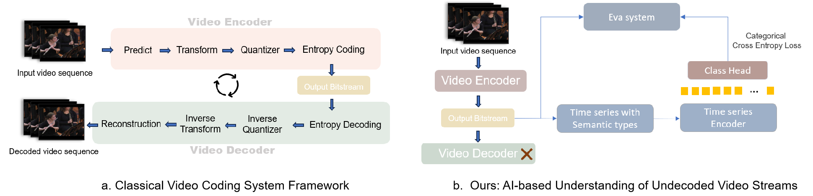
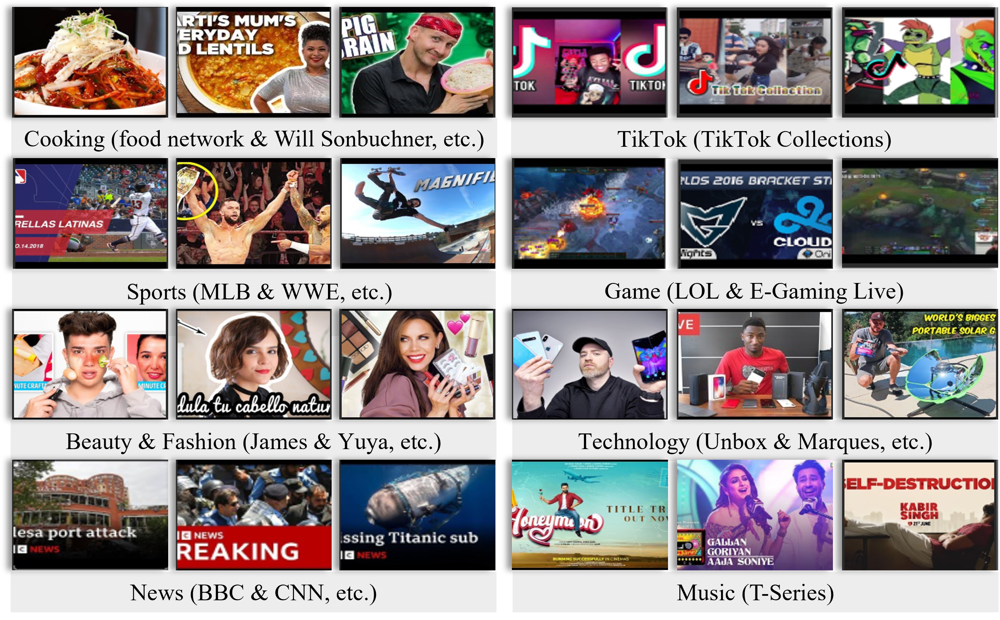

# A Zero Decoding Approach to Video Classification
*Chen Ye Gan, Jiangtao Wen, Yuxing Han*


This repository is the official implementation of **A Zero Decoding Approach to Video Classification**, accepted at ICME 2025. 

[](link-to-camera-ready)
[](https://www.python.org/)
[](LICENSE)

## ✨ Highlights
- **Pixel-free**: learns directly from the H.264/AVC bitstream—no decode, protects data privacy.
- **15,000×** real-time throughput on 30 fps video.
- ~90 % accuracy on a 6,000hr YouTube dataset (11 classes).
- **7 orders-of-magnitude** faster than DTW, **3 orders** faster than CNN baselines.


<p align="center" width="100%">

</p>

## Table of Contents
1. [Overview](#overview)  
2. [Dataset](#dataset)  
3. [Installation](#installation)  
4. [Quick Start](#quick-start)  
5. [Citation](#citation)  
6. [Acknowledgements](#acknowledgements)

<a name="overview"></a>
## Overview

*Abstract* — Classifying videos into distinct categories, such as Sport and Music Video, is crucial for multimedia understanding and retrieval, especially with growing content volume. Traditional methods require video decompression to extract pixel level features like color, texture, and motion, thereby increasing computational and storage demands. We present a novel approach that examines only the compressed bitstream of a video to perform classification, eliminating the need for bitstream decoding. To validate our approach, we built a comprehensive data set comprising over 29,000 YouTube video clips, totaling 6,000 hours and spanning 11 distinct categories. Our evaluations indicate precision, accuracy, and recall rates consistently above 80%, many exceeding 90%, and some reaching 99%. The algorithm operates approximately 15,000 times faster than real-time for 30fps videos, outperforming traditional Dynamic Time Warping (DTW) algorithm by seven orders of magnitude and state-of-the-art video classification model by three orders of magnitude.

<a name="dataset"></a>
## Custom Dataset
### Download
We created a large dataset consisting of 29,142 video clips, each containing at least 3,000 frames.
[Download](https://tinyurl.com/bitstream-video-data)

<p align="center" width="100%">

</p>

### Data preprocessing
Transcoded the input video to different Mbps using the FFmpeg open-source H.264/AVC encoder with the same encoding settings.

```
Average Bitrate (ABR) mode: ffmpeg -i input.mp4 -c:v libx264 -b:v 1.5M output.mp4
Constant Bitrate (CBR) mode: ffmpeg -i input.mp4 -c:v libx264 -crf 23 output.mp4
```

<a name="installation"></a>
## Installation

The complete implementation is located in the `Video_Classification_Model` folder.


```sh
## pip
pip install -r requirements.txt

## conda
conda create --name entropy --file entropy-env.txt
conda activate entropy
```

<a name="quick-start"></a>
## Quick Start

Overview: videos -> covers -> design matrix -> train -> eval -> predict

1. place videos to extract in folder `1-input_videos`
2. run `python extract.py`
3. the extracted covers are placed in `2-covers`
    - The resulting CSVs will have three columns, namely Video Path, Frame Number, Frame size (in bytes)
4. run `python collate.py` to collate covers into a single well formatted design matrix, saved in `3_model_input_data`
5. run `python train.py`, checkpoints saved in `4_checkpoints`
6. run `python eval.py` to evaluate, be sure to change `CHECKPOINT_PATH` before running
7. run `python predict.py` to predict on new dataset, which needs to be in a design matrix. Change `MODEL_PATH` and `data_path` accordingly. 


<a name="citation"></a>
## Citation
```bibtex
@inproceedings{gan2025zerodecode,
  title     = {A Zero Decoding Approach to Video Classification},
  author    = {Gan, Chen Ye and Wen, Jiangtao and Han, Yuxing},
  booktitle = {Proc. IEEE Int. Conf. Multimedia \& Expo (ICME)},
  year      = {2025}
}
```

<a name="acknowledgements"></a>
## Acknowledgements

The authors thank Yuchen Deng and Fengpu Pan for their assistance in data collection and Haoyue Han for paper review.

This work is supported by Shenzhen Startup Funding No.QD2023014C. 

